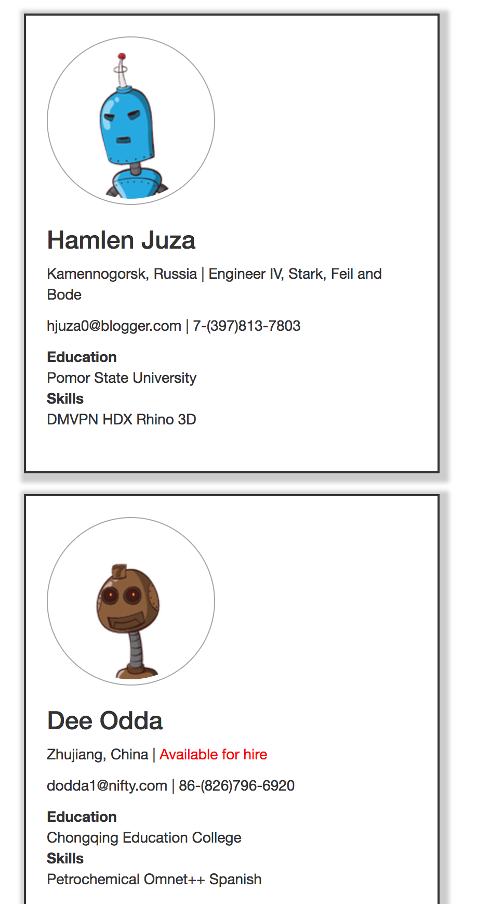

# A user directory of fictional robots

1. Robot data stored in MongoDB.
1. CRUD operations served through Express.
1. Authentication using Passport (bcryptjs password/Mongo persistent store).
1. Anonymous user can view entire directory.
1. Authenticated user can edit only their profile.

